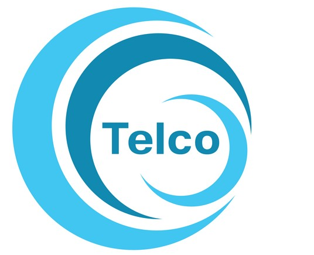

    

# README

### by Jeanette Schulz 2021-11-29

 

# Project Goal
The goal of this project is to discover features that may be related to churn, and use these discoveries to create a machine learning classification model that can predict if a customer is about to churn or not.

 

# Project Description
The buisness world is constantly changing, and it's sometimes hard to pinpoint why customers come and go from a company. Telco is an internet and phone company with a higher customer turn over than they'd like. Signing new customers up is a lot more expensive that keeping a customer, which is why most companies try so hard to keep thier customers from leaving. We will analye the data provided from customer accounts to see who is most likely to leave, develope a model for predicting customer turnover (also known as "churn"), and deliver both a recommendation for how to prevent customer churn and a prediction of customers who will soon churn (delivered via csv). 

 

# Project Planning
## Plan -> Acquire -> Prepare -> Explore -> Model & Evaluate -> Deliver

<b>Planning:</b>  
- Create a README file (check!)
- Ensure my wrangle.py modules are well documents and functional

<b>Acquisition </b>  
- Obtain Telco data from Codeup mySQL database via wrangle.py

<b>Preparation</b>  
- Clean Telco data from Codeup mySQL database via wrangle.py

<b>Exploration and Pre-processing</b>  
- Ask and answer statistical questions about the Telco data
- Visually represent findings with charts

<b>Modeling</b>  
- Split data appropriately 
- Use knowledge acquired from statistical questions to help choose a model
- Create a predictions csv file from the best model

<b>Deliver</b>  
- Deliver a 5 minute presentation via a jupyter notebook walkthrough 
- Answer questions about my code, process, and findings

 

# Data Dictionary

| Feature                    | Datatype               | Description                                                           |
|:---------------------------|:-----------------------|:----------------------------------------------------------------------|
| customer_id                | 7043 non-null: object  | Identification number for customer                 |
| gender                     | 7043 non-null: object  | Customer gender, male or female                    |
| senior_citizen             | 7043 non-null: int64   | Yes or No, is the customer a senior citizen        |
| partner                    | 7043 non-null: object  | Yes or No, does the customer customer has a parter |
| dependents                 | 7043 non-null: object  | Number of dependents a customer has                |
| tenure                     | 7043 non-null: int64   | Months a customer has been with the company        |
| phone_service              | 7043 non-null: object  | Phone Service plan, Yes or No                      |
| multiple_lines             | 7043 non-null: object  | Multiple lines, Yes or No                          |
| internet_service_type_id   | 7043 non-null: int64   | 1, 2, 3                                            |
| online_security            | 7043 non-null: object  | Yes, no, or no internet service                    |
| online_backup              | 7043 non-null: object  | Yes, no, or no internet service                    |
| device_protection          | 7043 non-null: object  | Yes, no, or no internet service                    |
| tech_support               | 7043 non-null: object  | Yes, no, or no internet service                    |
| streaming_tv               | 7043 non-null: object  | Yes, no, or no internet service                    |
| streaming_movies           | 7043 non-null: object  | Yes, no, or no internet service                    |
| contract_type_id           | 7043 non-null: int64   | 1, 2, 3                                            |
| paperless_billing          | 7043 non-null: object  | Yes or no, customer uses paperless billing         |
| payment_type_id            | 7043 non-null: int64   | 1, 2, 3, 4                                         |
| monthly_charges            | 7043 non-null: float64 | Monthly charges the customer pays                  |
| total_charges              | 7043 non-null: object  | Total charges the customer has paid                |
| churn                      | 7043 non-null: object  | Yes or no, whether or not the customer has churned |
| contract_type_id.1         | 7043 non-null: int64   | 1, 2, 3                                            |
| contract_type              | 7043 non-null: object  | Month-to-month, One year, Two year                 |
| internet_service_type_id.1 | 7043 non-null: int64   | 1, 2, 3                                            |
| internet_service_type      | 7043 non-null: object  | DSL, Fiber Optic, or None                          |
| payment_type_id.1          | 7043 non-null: int64   | 1, 2, 3, 4                                         |
| payment_type               | 7043 non-null: object  | E-check, mailed check, bank transfer, credit card  |

 

# Steps to Reproduce

You will need your own env file with database credentials along with all the necessary files listed below to run the `"Final Report"` notebook.

 1. Read this README.md
 2. Download at the aquire.py and Final Report.ipynb file into your working directory
 3. Create a .gitignore for your .env file
 4. Add your own env file to your directory with username, password, and host address. 
 5. Run the final_report.ipynb notebook

 

# Initial Questions for the Project

1. Are customers with Fiber internet more likely to churn than customers with DSL?
2. Are customers who pay manually more likely to churn than customers who pay automatically?
3. Do customers who churn have a higher average monthly charge than those who don't?
4. Are customers with dependents/partners on thier contract more likely to churn than those without?

